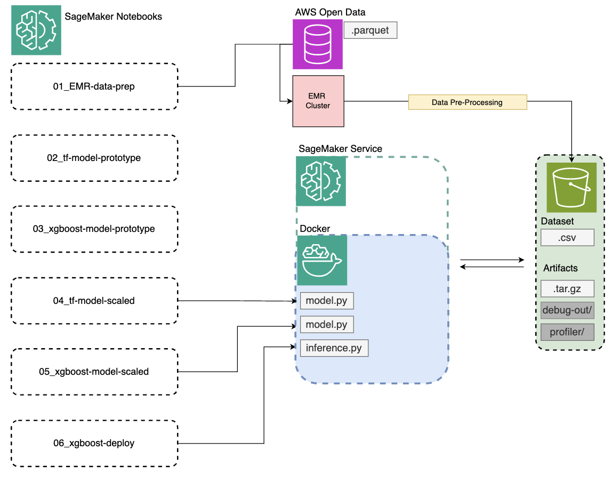

# Big Data: Fare Prediction w/ Spark, XGBoost and TensorFlow

This project covers the data exploration, preprocessing, model development and deployment of models predicting the fare price for taxi rides in NYC. Topics covered include:
- NYC Taxi Dataset download and EDA in Databricks SQL environment utilizing Databricks visualizations & dashboarding 
- Spark data processing and EMR cluster setup in the AWS ecosystem
- Tensorflow and XGBoost model prototyping
- Scaled ephemeral training in AWS SageMaker with custom training scripts
- Simple model endpoint deployment

### Project Diagram:

### Databricks Dashboard Snapshot:

NYC Taxi Dataset:
- AWS Open Data Registry: https://registry.opendata.aws/nyc-tlc-trip-records-pds/
- NYC Taxi Dataset Source: https://www.nyc.gov/site/tlc/about/tlc-trip-record-data.page
- Data Dictionary: https://www.nyc.gov/assets/tlc/downloads/pdf/data_dictionary_trip_records_green.pdf

Resources:
- EMR Cloud Formation Templates: 
https://aws.amazon.com/blogs/machine-learning/part-1-create-and-manage-amazon-emr-clusters-from-sagemaker-studio-to-run-interactive-spark-and-ml-workloads/
- Sagemaker EMR NYC Tutorial: https://github.com/aws-samples/sagemaker-studio-emr/tree/main/workshop/04_DeepLearning
- AWS XGBoost Documentation: https://sagemaker.readthedocs.io/en/stable/frameworks/xgboost/using_xgboost.html
- SageMaker Storage Paths: https://docs.aws.amazon.com/sagemaker/latest/dg/model-train-storage.html
- Training Data Access Types: https://docs.aws.amazon.com/sagemaker/latest/dg/model-access-training-data.html
